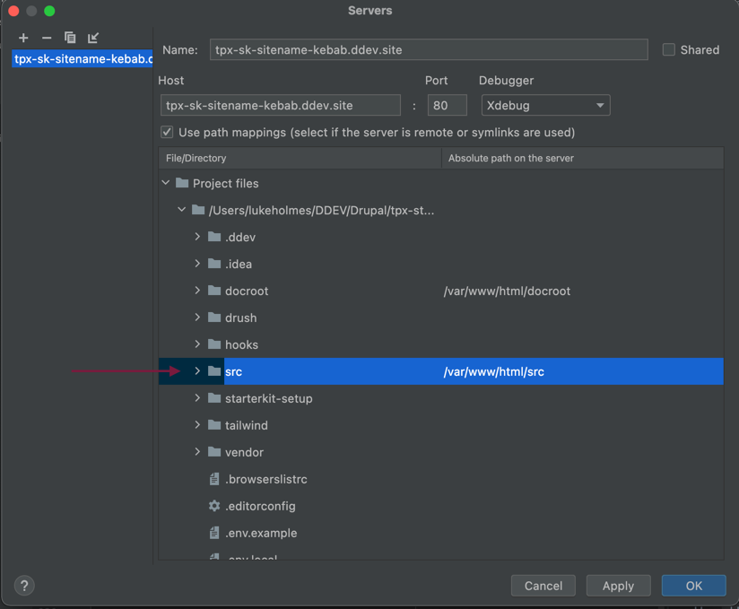

# tpx_sk_sitename - Website


This repository contains tpx_sk_sitename website codebase.

## Built With

* CMS: [Drupal 9](http://www.drupal.org), through [recommended-project](https://github.com/drupal/recommended-project)
* Storybook
* Live Environment/Hosting: [Acquia Cloud](https://www.acquia.com/products-services/acquia-cloud)
* Development Environment: [DDEV](https://ddev.readthedocs.io/en/latest/users/cli-usage/#drupal-9-quickstart)
* CI/CD: Bitbucket pipelines

## Getting Started

We use GNU Make utility to help setting up, maintaining and running common tasks on local instances. Makefile "targets" - jargon for commands - must be run from the project root directory, where the
Makefile file lives.

See the "Additional Notes - Make utilities" section below for the whole list of commands.

### Prerequisites

Before starting setting up your local instance, you need:

* [Docker and docker-compose](https://www.docker.com/community-edition).
* PHP > 8.1
* [Composer](https://getcomposer.org/download/)
* [DDEV](https://ddev.readthedocs.io/en/latest/) >= 1.19.5
* PHP Code Sniffer and Drupal Coding Standards (see **Coding style tests** section)
* GNU Make utility (Install `build-essential` on Linux, 'Developer tools' or 'Xcode' on Mac or via `homebrew`)
* Node, NPM

### Installing

Running `make install` sets up your instance. You should use this command only the first time you are setting
up your local instance - for example after you've cloned this repo - or after manually uninstalling the instance.

Your site should now run on [https://site.ddev.site/](https://site.ddev.site/)

From now on just use `make up` for starting your docker containers.

Now and then you may need to re-install Drupal (and only Drupal!). You can do this by running `make drupal-site-install`.<br />
Remember: Re-installing the full Drupal instance may take a while, so be aware.

## Storybook
The Storybook is used to facilitate the implementation of ATOMIC principles when building out the UI components and
separate the UI components from the underlying patterns defined by Drupal (or any other system). The approach to the
pattern library should be platform-agnostic and assume that the pattern themselves may be used anywhere within the project
ecosystem. To that end, pattern logic should be self-contained and not rely on any logic or assets that exist outside of Storybook.

### Starting Storybook
You can start the Storybook by running the command:

`make watch-storybook theme=site`

Replace the `theme` option with the name of the Storybook instance that should be used.

This should spin up the Storybook in 'watch mode' and launch it in your default browser.

### Make changes to the Storybook
Once the Storybook is up and running, any changes to the markup will trigger Storybook to rebuild.

### Copying the patterns to Drupal
To copy the patterns to Drupal run the command `make build-theme theme=site`.

Replace the `theme` option with the name of the Drupal theme that should be used.

## Coding style

Please follow Drupal coding standards (and use the [.editorconfig](http://editorconfig.org/)(s) rules!) when writing code.

On creating a Pull Request your changes will be inspected for any Drupal Coding Standard issues.
You will be asked to fix those before your PR is merged, so it's much better to avoid pushing code with issues by:
* Setting your IDE/Editor to integrate with .editorconfig file.
* Setting up you IDE/Editor to flag Coding Standard issues while writing your code.
* [Setup PHP CodeSniffer to analyse your code on commit through the Git commit hook](https://www.drupal.org/node/2067677).

A `make coding-standards` helper has been created to run coding standards scan, i.e. before commit.

## Development Workflow

#### Tools we are using ####

- JIRA (tickets tracking)
- Bitbucket (Git server)
- Bitbucket Pipelines (CI/CD service)

We use these tools to track the state of any part of the project and keep us in-sync.

#### Step 1 - JIRA ####
We use JIRA and its ticket to keep track of Sprint or Release goals. When you start working on a ticket,
move it to the _In Progress_ column on the project board. Make sure the ticket is assigned to you, so
the team knows you are on it.

JIRA is integrated with Bitbucket, so you can - and should - create your branch from JIRA itself, from the
"Create a branch" call-to-action.
**Make sure the correct Repository is selected when creating the branch.**

Normally you should branch from `master`, but check with your team member which one is the right source for
your branch.

We use git-flow naming convention, so if you are working on a new feature, prefix your branch name
with `feature/` followed by the suggested name, which normally is the ticket code ID followed by a
machine-friendly version of the ticket title.

At this point your branch is created, you can now fetch and check it out.

#### Step 2 - (Almost) Ready to work ####

When starting new work, it's always good habit to reset/update your instance. The best way is to run
`ddev composer install` first - to reset the codebase - and then `make cim`, which will automatically
import the Drupal configuration, removing any left over from previous work. In some scenario this
may not work due some conflict (i.e. trying to uninstall a module which does not exist), in that
case the best option is `make drupal-site-install`. Just remember this can take some time... so probably
would be quicker to checkout back the branch where the conflict doesn't exist (i.e. the missing module exists),
then remove the conflict (i.e. uninstall the module), checkout back your feature branch and try `make cim` again.
If the conflict is resolved the command should now run successfully.

Use the `make seed-db` command to copy the database from the Acquia dev site and import it to your local site.

#### Step 4 - Work on the feature ####

You don't need guidelines for this :)

Remember the codebase is composer-driven, so install, update and remove modules only through
composer commands, i.e.:

```bash
ddev composer require drupal/page_manager
ddev composer update drupal/page_manager --with-dependencies
ddev composer remove drupal/page_manager
```

At the end of your work don't forget to add you configuration changes. Use `make cex` to easily
export them but **MAKE SURE YOU COMMIT ONLY THE CHANGES RELEVANT TO YOUR WORK**. Exporting Drupal
configuration often leaks unwanted changes (most of them are valid, but still unwanted).
Revert unwanted exports before commit.

It is a good habit to run `make tests` before pushing, to make sure checks and tests are not failing.

#### Step 5 - Push your changes ####

Always push your changes before stepping out from work (moving to other project or before EOD).
In this way you are backed up if anything happens **AND** the team can pick up your work if needed!

If you've completed the work (ticket requirements are fulfilled, no CS issues, etc.) create a PR
in order for your changes to be merged on the upstream branch. You can either do this from the link
bitbucket provides you after pushing, or from Bitbucket Web UI.

#### Step 6 - Review to be Reviewed ####

The rule is: you need 3 approvals before your changes are merged!
So tell the team your PR is ready to be reviewed by moving your ticket on JIRA on the Peer Review
column.

Normally 1 is from Jenkins, 1 from the Peer Review and 2 is from the committer. It's a good practice
at this point to review other team members PRs. If you help them with their code they will be more
keen on reviewing yours.

Don't feel shy. Peer Review is a moment for everyone to learn, there are neither levels nor ranks
and mostly important no wrong questions nor answers. **A good Peer Review today reduce the possibility of
issues tomorrow**, so the time is always worth spent.

Due this reason you may be asked to update the changes in your branch. This is an opportunity and never
a prosecution.

At this point your are - potentially - free to take another ticket, and start back from Step 1.

## Deployment

**TODO**

## Releases and Versioning

**TODO**

## Additional Notes

### Make utilities

* `make help`: view available commands with descriptions.
* `make install`: sets up your instance.
* `make up`: starts the instance. From second time on run this command to start all the services.
* `make drupal-site-install`: sometime can be useful to destroy and re-create the Drupal installation.
* `make stop`: stops the instance
* `make cex`: exports Drupal configuration
* `make cim`: imports Drupal configuration
* `make cc`: clears Drupal cache
* `make uli`: generates login link for 'user 1' Drupal admin
* `make mysql`: give you the MySQL shell connecting to the Drupal db instance.

### General usage

* Get into the box itself with `ddev ssh`
* Add a module to the build with `ddev composer require drupal/page_manager`. This will add the module to composer.json and download the module to the Docker instance. You'll then need to install it yourself (see below). Note that this will add it to the require, as opposed to the require-dev, section.
* You can enable a module easily either via Drush - `ddev exec drush en page_manager`
* See logs by running `ddev logs` - to see them in real time run `ddev logs -f`

### Debugging with Xdebug ###

Run command `ddev xdebug` to enable Xdebug.

#### Xdebug Configuration ####
In your PHPStorm server configuration, you'll need to set where the `src` directory lives on the server, which is `/var/www/html/src`.



### Working with the database ###

Use `ddev sequelpro` to open the database with SequelPro or SequelAce. Use `ddev mysql` if you need direct access
to MySQL console.

## Subsite ##

The Subsite website has been implemented as a multisite instance, Subsite also has its own design system and Storybook instance.

### Getting started ###

Subsite will be installed as part of the initial install process when the `make install` command is ran.

The site can be accessed on [https://site.ddev.site/](https://site.ddev.site/)

Run make commands against the site by appending `site=endeavour`, for example `make uli site=endeavour` for admin access onetime link.

### Other helpful commands ###

- **Generate an admin login link:** ``make uli site=tpx-sk-subsitename-kebab``
- **Clear the Drupal cache:** `make cc site=tpx-sk-subsitename-kebab`
- **Export config:** `make cex site=tpx-sk-subsitename-kebab`
- **Import config:** `make ci  site=tpx-sk-subsitename-kebab`

tpx_sk_subsitename site config is stored in `src/config/tpx_sk_subsitename_snake`

Build Storybook using `make build-storybook-tpx-sk-subsitename-kebab`.

You can use `make watch-storybook-tpx-sk-subsitename-kebab` to watch & build changes in Storybook.

Build the Drupal theme using `make build-theme-tpx-sk-subsitename-kebab`.

You can use `make watch-theme-tpx-sk-subsitename-kebab` to watch & build changes for the Drupal theme.


## Authors

* **Jack Holding** - *Initial work* - [jack.holding@tpximpact.com](mailto:jack.holding@tpximpact.com)
* **Nicolas Borda** - *Updates and multisite related information* - [nicolas.borda@tpximpact.com](mailto:jack.holding@tpximpact.com)
