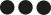

import { Meta, Canvas } from '@storybook/addon-docs/blocks';
import { Badge } from '@storybook/components';
import { storage } from '@wingsuit-designsystem/pattern';
import LinkTo from '@storybook/addon-links/react';
import logo from './images/subsite-logo.svg';
import './images/ws-tokens.svg';
import './images/ws-atoms.svg';
import './images/ws-molecules.svg';
import './images/ws-organisms.svg';
import './images/ws-templates.svg';
const tailwindFile = require('../../config/silo/tailwind.json');
const colors = tailwindFile.tailwind.theme.colors;

<Meta title="Welcome"
  parameters={{ viewMode: 'docs', previewTabs: { canvas: { hidden: true }}}}
/>

  

    
  

# Subsite design system

  ##  Tokens
  <Canvas>
    <LinkTo story="page" kind="Tokens/Colours">
      <Badge status="neutral">Colours</Badge>
    </LinkTo>
    <LinkTo story="page" kind="Tokens/Typography">
      <Badge status="neutral">Typography</Badge>
    </LinkTo>
    <LinkTo story="page" kind="Tokens/Scale">
      <Badge status="neutral">Scale</Badge>
    </LinkTo>
    <LinkTo story="page" kind="Tokens/Icons">
      <Badge status="neutral">Icons</Badge>
    </LinkTo>
  </Canvas>

  ##  Atoms
  <Canvas>
    {
      storage.loadPatternsByNamespace('Atoms').map((pattern)=>{
        return (
          <LinkTo key={pattern.getId()} story={pattern.getDefaultVariant().getLabel()} kind={`${pattern.getNamespace()}-${pattern.getId()}`}>
            <Badge status="neutral">{pattern.getLabel()}</Badge>
          </LinkTo>
        )
      })
    }
  </Canvas>

  ##  Molecules
  <Canvas>
    {
      storage.loadPatternsByNamespace('Molecules').map((pattern)=>{
        return (
          <LinkTo key={pattern.getId()} story={pattern.getDefaultVariant().getLabel()} kind={`${pattern.getNamespace()}-${pattern.getId()}`}>
            <Badge status="neutral">{pattern.getLabel()}</Badge>
          </LinkTo>
        )
      })
    }
  </Canvas>

  ##  Organisms
  <Canvas>
    {
      storage.loadPatternsByNamespace('Organisms').map((pattern)=>{
        return (
          <LinkTo key={pattern.getId()} story={pattern.getDefaultVariant().getLabel()} kind={`${pattern.getNamespace()}-${pattern.getId()}`}>
            <Badge status="neutral">{pattern.getLabel()}</Badge>
          </LinkTo>
        )
      })
    }
  </Canvas>

  ##  Templates
  <Canvas>
    {
      storage.loadPatternsByNamespace('Templates').map((pattern)=>{
        return (
          <LinkTo key={pattern.getId()} story={pattern.getDefaultVariant().getLabel()} kind={`${pattern.getNamespace()}-${pattern.getId()}`}>
            <Badge status="neutral">{pattern.getLabel()}</Badge>
          </LinkTo>
        )
      })
    }
  </Canvas>

